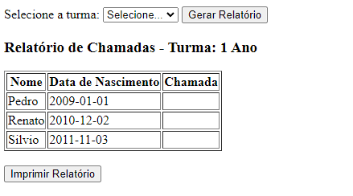

# Controle Escolar - Sistema Simples em PHP
Este é um sistema de controle escolar desenvolvido em PHP, que permite cadastrar alunos, turmas e realizar matrículas.

Como Usar
Cadastro de Alunos: Adicione novos alunos ao sistema fornecendo nome, data de nascimento e CPF.
Cadastro de Turmas: Crie novas turmas especificando o ano, a descrição e o número de vagas disponíveis.
Matrículas: Matricule alunos em turmas existentes.
Geração de Relatórios: Crie relatórios de chamadas para as turmas selecionadas.
Exemplo de Uso: Criando um realatorio para a turma "1 Ano"

    

Contribuição
Contribuições são bem-vindas! Se você encontrar um bug ou tiver alguma sugestão de melhoria, sinta-se à vontade para abrir uma issue ou enviar um pull request.
